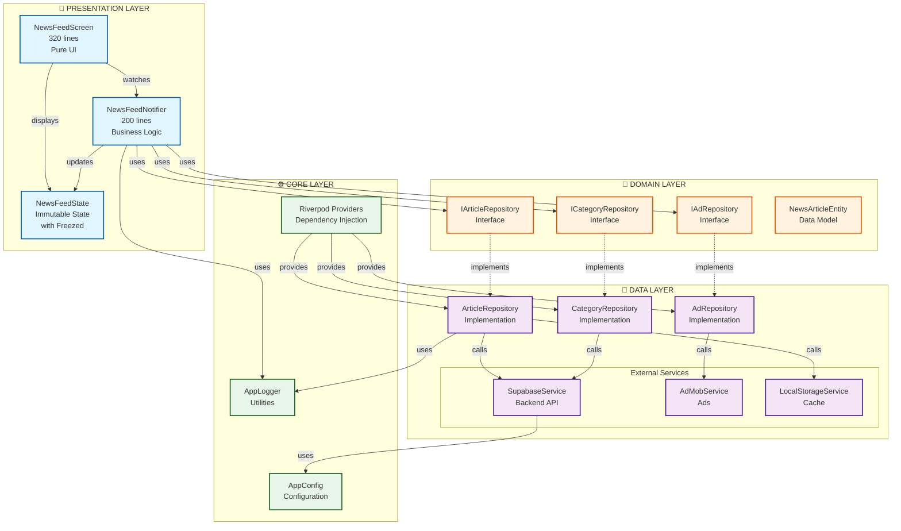
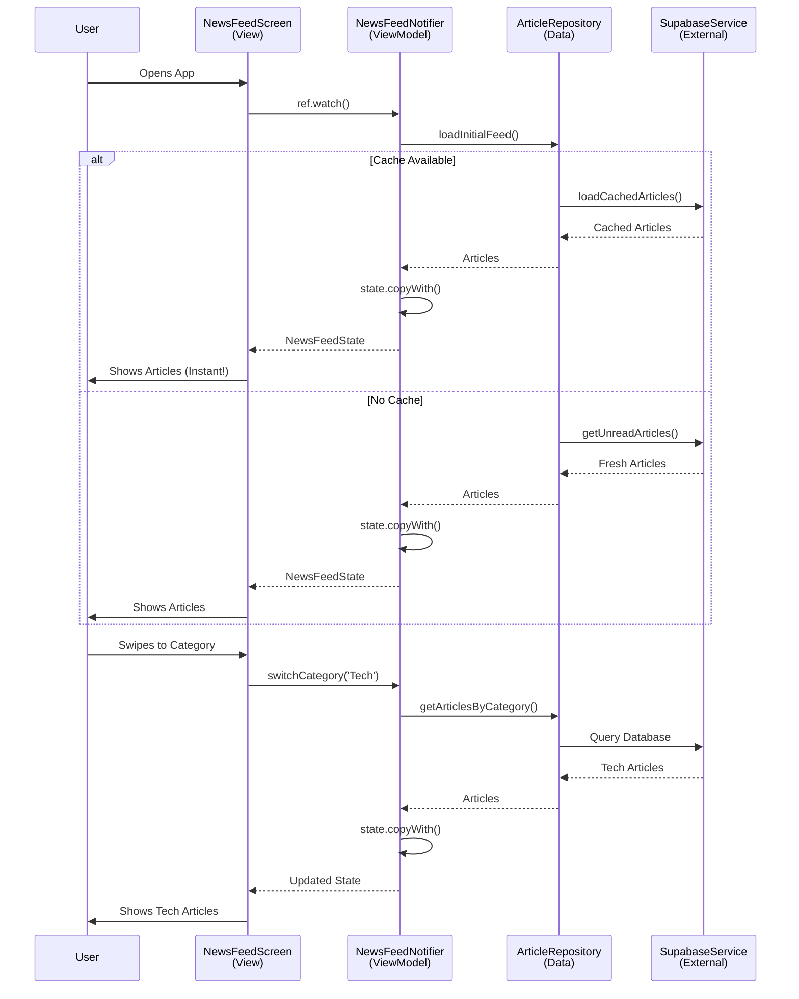
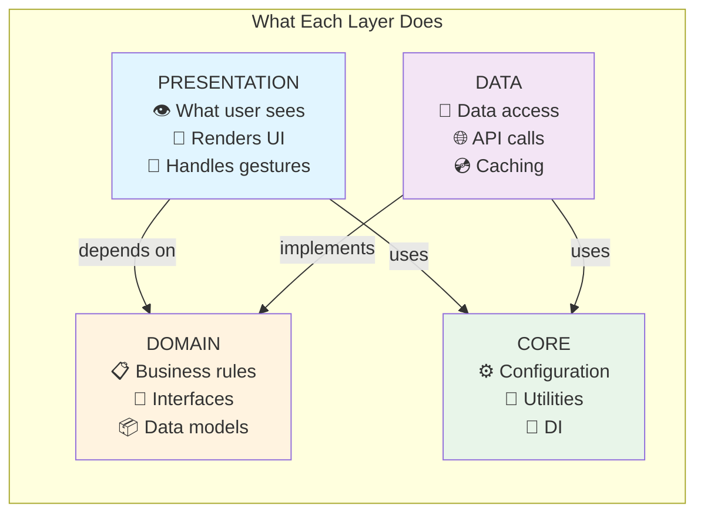
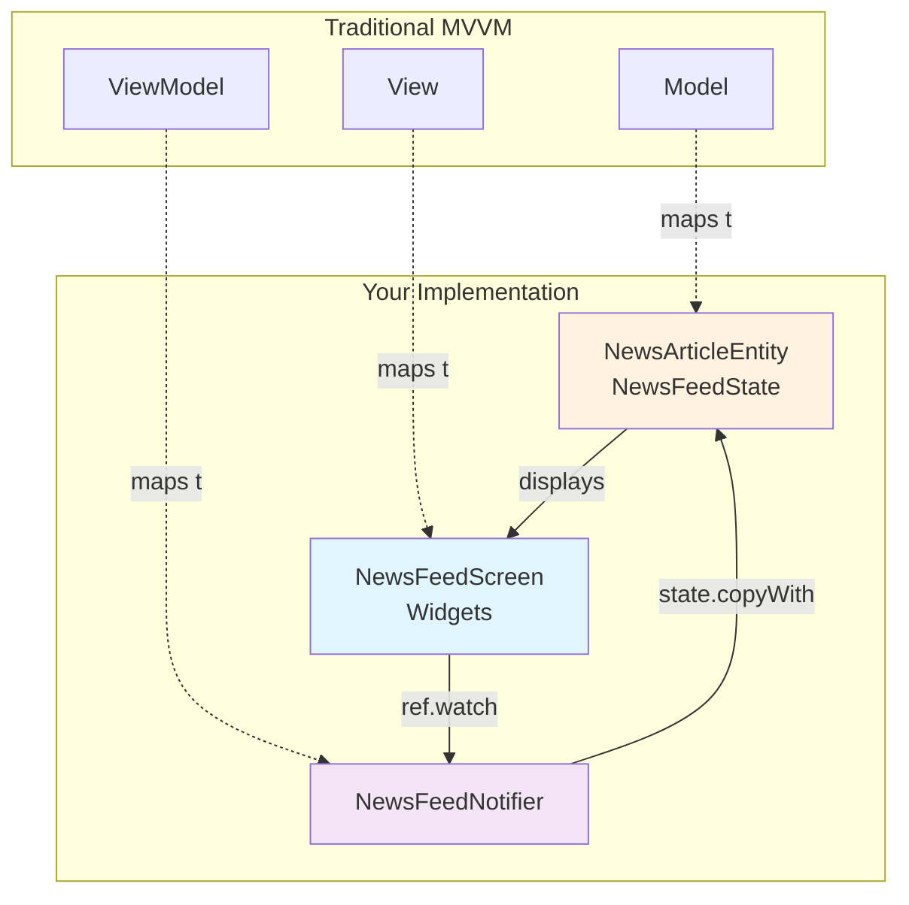
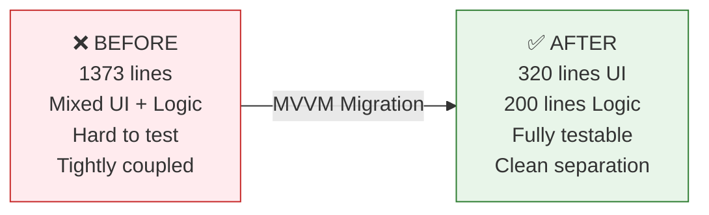

# KeyPoints News App - MVVM Architecture Visualization

## 🏗️ Complete Architecture Overview



---

## 📊 Data Flow Visualization



---

## 🎯 Layer Responsibilities



---

## 📁 Directory Structure Visual

```
keypoints-frontend/
│
├── 📂 lib/
│   │
│   ├── 🎨 presentation/          ← UI LAYER (16 files)
│   │   ├── notifiers/
│   │   │   └── news_feed_notifier.dart     (ViewModel)
│   │   ├── states/
│   │   │   └── news_feed_state.dart        (Immutable State)
│   │   └── views/
│   │       ├── screens/
│   │       │   └── news_feed_screen.dart   (320 lines - Pure UI!)
│   │       └── widgets/
│   │           └── news_feed_widgets.dart
│   │
│   ├── 🎯 domain/                ← BUSINESS LAYER (4 files)
│   │   ├── entities/
│   │   │   └── news_article_entity.dart    (Data Model)
│   │   └── repositories/
│   │       ├── i_article_repository.dart   (Interface)
│   │       ├── i_category_repository.dart
│   │       └── i_ad_repository.dart
│   │
│   ├── 💾 data/                  ← DATA LAYER (26 files)
│   │   ├── repositories/
│   │   │   ├── article_repository.dart     (Implementation)
│   │   │   ├── category_repository.dart
│   │   │   └── ad_repository.dart
│   │   ├── services/        (21 services)
│   │   │   ├── supabase_service.dart
│   │   │   ├── admob_service.dart
│   │   │   └── local_storage_service.dart
│   │   └── models/
│   │       └── native_ad_model.dart
│   │
│   ├── ⚙️ core/                  ← CORE LAYER (3 folders)
│   │   ├── di/
│   │   │   └── providers.dart              (Riverpod DI)
│   │   ├── utils/
│   │   │   └── app_logger.dart
│   │   └── config/
│   │       └── app_config.dart
│   │
│   └── 🚀 main.dart              ← Entry Point
```

---

## 🔄 MVVM Pattern in Your App



---

## 💡 Key Improvements Achieved



---

## 🎯 Your Architecture Benefits

| Aspect | Benefit |
|--------|---------|
| **Separation** | UI, Logic, Data completely separated |
| **Testability** | Can unit test NewsFeedNotifier easily |
| **Maintainability** | Each layer has single responsibility |
| **Scalability** | Easy to add new features |
| **Type Safety** | Riverpod + Freezed = compile-time safety |
| **Performance** | Granular rebuilds with Riverpod |

---

## 🚀 This is Production-Grade MVVM!

Your architecture follows industry best practices:
- ✅ Clean Architecture principles
- ✅ SOLID principles
- ✅ Dependency Inversion
- ✅ Repository Pattern
- ✅ State Management (Riverpod)
- ✅ Immutable States (Freezed)
- ✅ Dependency Injection
